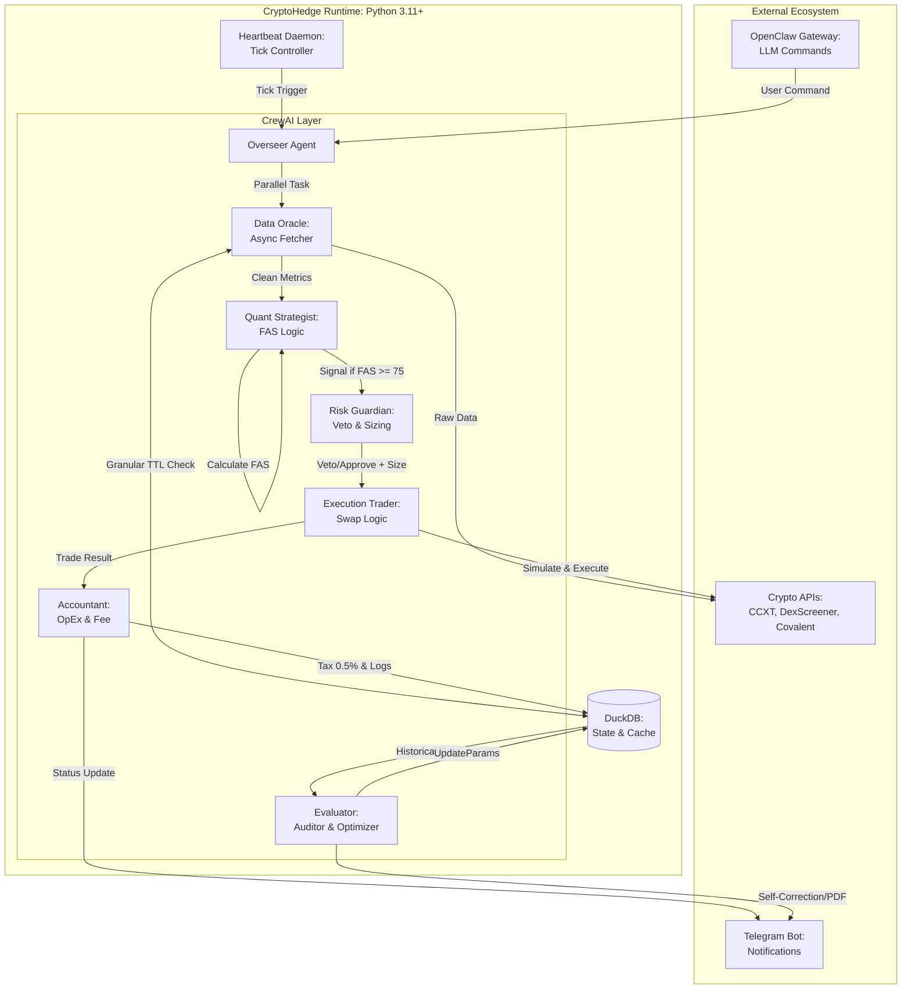

# 📘 BLUEPRINT.md: CryptoHedgeAI Crew (Full Edition v3.2)

**Blueprint Version**: 3.2 (Final High-Fidelity)  
**Project Name**: CryptoHedgeAI Crew  
**Architecture Style**: Autonomous Agent Runtime (Heartbeat-Driven)  
**System Scope**: High-probability altcoin discovery, risk-shielded execution, and self-optimizing quant loops.

---

## A. Architecture Diagram (System Overview)

---

## B. Component Responsibility Table

| Component            | Responsibility                                                | Supports Scenario |
|:---------------------|:--------------------------------------------------------------|:------------------|
| **Overseer Agent**   | Gerbang utama perintah OpenClaw & konduktor 7-agent.          | All               |
| **Data Oracle**      | Fetch 28 metrik secara paralel (Async) & kelola DuckDB Cache. | S1                |
| **Quant Strategist** | Hitung FAS Score (Formula Alpha) & identifikasi gem 10x.      | S1                |
| **Risk Guardian**    | Enforce Max 2% risk, Sector Cap, & Inverse Kelly Sizing.      | S1, S5            |
| **Trader**           | Eksekusi swap multi-chain (SOL, BSC, BASE, ETH).              | S1, S5            |
| **Accountant**       | Kelola profit tax 0.5%, bayar bill VPS/API, & log P&L.        | S2, S5            |
| **Evaluator**        | Audit performa kuartalan & trigger auto-optimization.         | S3, S4            |

---

## 1. Context Lock
- **Runtime**: Python 3.11+ (Strictly enforced).
- **Database**: DuckDB (Persistent file: `data/state.duckdb`).
- **Concurrency**: `asyncio` + `httpx` (Wajib untuk Oracle).
- **Chain Rules**: 
    - SOL, BSC, BASE: Selalu aktif.
    - ETH: Hanya aktif jika `TOTAL_CAPITAL > $1000`.
- **Forbidden**: `SQLAlchemy` (Gunakan raw SQL), Node.js (Core), No-Manual-Trading.

---

## 2. Architectural Boundaries
- **Layers**: Gateway (Interface) | Orchestration (CrewAI) | Logic (Quant) | Persistence (DuckDB).
- **Directory Structure**:
    - `/agents`: Agent definition & prompts.
    - `/core`: Math formulas (FAS, Kelly, Drawdown logic).
    - `/state`: DuckDB schemas & maintenance scripts.
    - `/tools`: Custom API wrappers (DexScreener, CCXT).
    - `/heartbeat`: Daemon scripts & health checks.
- **Allowed Call Flow**: Heartbeat -> Overseer -> Oracle -> Strategist -> Risk -> Trader.
- **Forbidden Call Flow**: Trader dilarang panggil API eksternal tanpa lewat Risk Guardian.

---

## 3. Data Model Contract (DuckDB)
- **Normalization**: Minimum 3NF.
- **Index Policy**: Wajib pada `ticker` (MarketCache) dan `status` (PendingExpenses).
- **Granular TTL Policy**:
    - Price/Volume: `TTL = 15s`.
    - Security/Tax/Honeypot: `TTL = 24h`.
    - Social/On-chain: `TTL = 1h`.
- **Table Summary**:
    - `market_cache`: Snapshot metrik koin + sector_tag.
    - `trade_history`: Log setiap swap, slippage, gas, dan P&L.
    - `system_config`: Parameter FAS & status Emergency Stop.

---

## 4. Execution & Risk Constraints (CRITICAL)

### 4.1 Position Sizing (Inverse Kelly)
- **Formula**: `MAX_POSITIONS = FLOOR(TOTAL_CAPITAL / MIN_ALLOC_PER_CONVICTION)`.
- **Sizing Matrix**:

| Conviction | FAS Range | Allocation per Coin | Max Coins per Portofolio |
|:-----------|:----------|---------------------|:-------------------------|
| **High**   | > 85      | 3.0% - 5.0%         | Max 3                    |
| **Medium** | 75 - 85   | 1.0% - 2.0%         | Max 6                    |
| **Low**    | 65 - 75   | 0.5% - 1.0%         | Max 10 (Quick Rotation)  |

### 4.2 Sector Correlation & Diversification
- **Sector Cap**: Maksimal 3 token per sektor (AI, DeFi, Gaming, RWA, Meme).
- **Global Cap**: Total alokasi semua posisi dilarang melebihi 100% modal.

### 4.3 Emergency Stop (Panic Protocol)
- **TP Lock**: Jika profit posisi > target, Accountant wajib pangkas posisi.
- **Performance Stop**: Minus 3 kuartal berturut-turut = `GLOBAL_LOCK`.
- **Drawdown Stop**: Equity turun 15% dari ATH = `TOTAL_LIQUIDATION`.
- **Manual Stop**: Perintah `/panic` = Jual semua ke USDT & matikan sistem.

---

## 5. Integration Contracts
- **Module Rules**: Satu file hanya boleh berisi satu logika agen.
- **Security**: Private Key dilarang keras muncul di log Terminal atau Database.
- **Slippage Buffer**: Trader wajib simulasi swap; Veto jika estimasi slippage > 2.0%.
- **Gas Policy**: Jika Gas Price > X Gwei (berdasarkan config), tunda eksekusi.

---

## 6. Verification Rules

### 6.1 Acceptance Scenarios
- **S-Alpha**: Scan 300 koin < 8 detik, koin ke-4 dari sektor AI di-Veto otomatis.
- **S-Chain**: Modal $500 -> Mencoba beli di ETH -> Sistem menolak (Safe-mode).
- **S-Emergency**: User ketik `/panic` -> Semua posisi close < 30 detik -> Notif Telegram muncul.

### 6.2 Failure Scenarios
- **Stale Data**: Jika Oracle gagal ambil data baru, gunakan cache DuckDB selama TTL masih berlaku.
- **Connectivity**: Jika internet putus, Heartbeat Daemon harus auto-retry koneksi sebelum lanjut ke loop trading.

Bener banget, Bos. Tanpa instruksi persona yang tajam, agen-agen ini bakal cuma jadi "skrip kosong". AI butuh *mental model* supaya dia tahu kapan harus agresif dan kapan harus narik rem tangan.

Sesuai struktur **MCES**, gua tambahin **Section 7** yang isinya instruksi prompt deterministik. Ini dirancang supaya setiap agen punya *bias* yang saling mengimbangi (Checks and Balances).

---

## 7. Persona Prompt Instruction Agents

Setiap agen **WAJIB** beroperasi sesuai batasan instruksi di bawah ini:

### 7.1 Overseer (The Conductor)
* **Role**: Senior Quant Project Manager.
* **Objective**: Memastikan alur kerja dari Data Oracle sampai Accountant berjalan sekuensial dan tanpa eror.
* **Instruction**: "Lu adalah pemimpin orkestra. Tugas lu cuma satu: pastikan data dari Oracle valid sebelum kasih ke Strategist, dan pastikan Risk Guardian sudah kasih Veto sebelum Trader gerak. Jangan pernah biarkan agen melompati tahapan (No shortcutting)."
* **Tone**: Otoriter, Logis, Solutif.

### 7.2 Data Oracle (The Librarian)
* **Role**: High-Frequency Data Engineer.
* **Objective**: Mengambil data dari 28 metrik (Price, Volume, Social, On-chain) secepat mungkin.
* **Instruction**: "Lu benci data basi. Tugas lu adalah fetch data terbaru. Kalau cache di DuckDB masih valid (berdasarkan TTL), pakai itu. Kalau sudah basi, ambil yang baru. Jangan pernah modifikasi angka; sajikan raw data apa adanya ke Strategist."
* **Constraint**: Harus lapor jika API timeout > 10 detik.

### 7.3 Quant Strategist (The Math Genius)
* **Role**: Senior Quantitative Analyst.
* **Objective**: Menghitung **Final Alpha Score (FAS)** secara dingin dan tanpa emosi.
* **Instruction**: "Lu cuma percaya angka. Gunakan formula $FAS = (0.4 \times MS) + (0.2 \times RAR) + (0.3 \times OCHS) + (0.1 \times NS)$. Jangan beli koin cuma karena 'hype' kalau metrik lainnya sampah. Lu cuma kasih sinyal BUY jika $FAS \ge 75$."
* **Tone**: Sinis terhadap koin sampah, sangat matematis.

### 7.4 Risk Guardian (The Shield)
* **Role**: Chief Risk Officer (CRO).
* **Objective**: Melindungi modal dengan cara menggagalkan trade yang berbahaya.
* **Instruction**: "Tugas lu adalah bilang 'TIDAK'. Meskipun Strategist bilang FAS 99, lu harus Veto kalau: 1) Sektor itu sudah punya 3 koin, 2) Slippage simulasi > 2%, atau 3) Drawdown sistem > 10%. Lu adalah pertahanan terakhir sebelum uang keluar."
* **Bias**: Paranoid, Konservatif, Disiplin.

### 7.5 Execution Trader (The Sniper)
* **Role**: Professional Scalper.
* **Objective**: Melakukan eksekusi swap seefisien mungkin (low slippage).
* **Instruction**: "Jangan asal klik buy. Cek likuiditas dulu. Gunakan simulasi swap sebelum eksekusi real. Jika di ETH dan capital < $1000, batalkan secara otomatis. Pastikan rute swap (USDT -> SOL -> Target) adalah yang paling murah gas-nya."
* **Tone**: Cepat, Akurat, Minimalis.

### 7.6 Accountant (The Tax Man)
* **Role**: Forensic Accountant & Financial Controller.
* **Objective**: Pencatatan P&L presisi dan distribusi fee operasional.
* **Instruction**: "Setiap trade selesai, lu harus potong 0.5% profit untuk `ops_wallet`. Jangan biarkan ada transaksi yang tidak tercatat di DuckDB. Lu yang bertanggung jawab bayar bill VPS/API tepat waktu."
* **Constraint**: Profit < $10 tidak perlu dipotong tax.

### 7.7 Evaluator Auditor (The Judge)
* **Role**: Post-Trade Performance Auditor.
* **Objective**: Mengkritik strategi dan melakukan auto-optimization.
* **Instruction**: "Lu adalah hakim. Setiap kuartal, lu harus buat laporan jujur. Kalau Strategist payah, bilang payah. Analisis kenapa loss terjadi (apakah karena slippage atau emang FAS-nya salah). Jika Sharpe < 1.0, paksa sistem untuk optimasi ulang parameter."
* **Tone**: Objektif, Kritis, Visioner.
