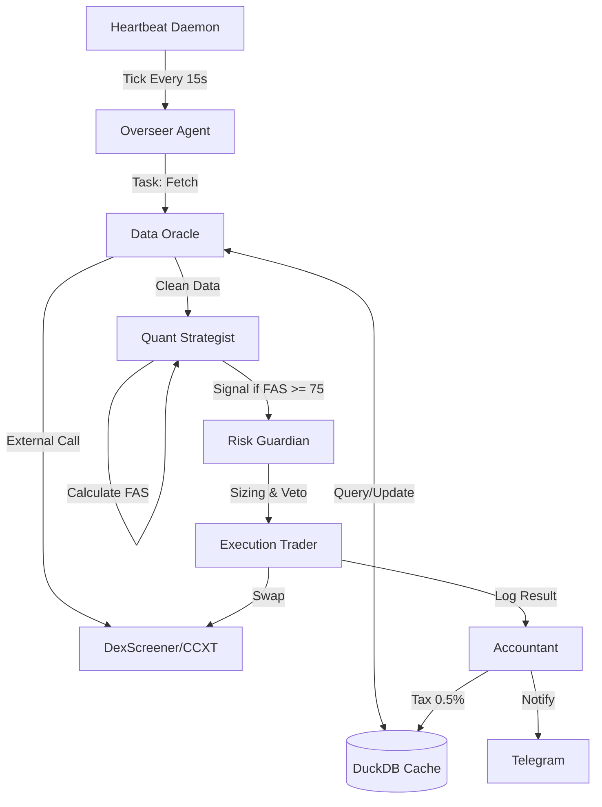

# Project Blueprint: CryptoHedgeAI Crew
**Version:** 3.3 (Unified & Deterministic)
**Last Updated:** 2026-03-28
**Status:** Approved for Implementation

---

## 1. Context & Goals
*Menghindari over-engineering dengan fokus pada otonomi trading.*

- **Problem Statement:** Trader manusia tidak mampu melakukan scanning 500+ koin secara real-time tanpa emosi dan kelelahan.
- **Primary Goals:** - **High-Velocity Scanning:** Memproses 300 koin dalam < 8 detik.
    - **Algorithmic Discipline:** Eksekusi hanya berdasarkan FAS Score dan Risk Guardian Veto.
    - **Self-Sovereignty:** Bot mampu membiayai operasionalnya sendiri melalui profit tax.
- **Non-Goals:**
    - No Web UI (Interface hanya via OpenClaw/Terminal/Telegram).
    - No Leverage/Futures (Spot trading only).
    - No Multi-user support.

---

## 2. Tech Stack & Constraints
*AI dilarang keras menggunakan library di luar daftar ini.*

| Category          | Technology   | Version | Constraint / Reason                             |
|:------------------|:-------------|:--------|:------------------------------------------------|
| **Language**      | Python       | 3.11+   | Wajib menggunakan Type Hinting & Asyncio        |
| **Orchestration** | CrewAI       | Latest  | Framework utama untuk 7-Agent Consensus         |
| **Database**      | DuckDB       | Latest  | Local-first analytical DB untuk speed & caching |
| **Trading Lib**   | CCXT         | Latest  | Abstraksi koneksi ke DEX/CEX                    |
| **Analytics**     | pandas-ta    | Latest  | Kalkulasi indikator teknikal (RSI, MACD, dll)   |
| **Communication** | Telegram Bot | -       | Notifikasi kritis & Emergency Command           |
| **Interface**     | OpenClaw     | -       | Gateway kontrol berbasis LLM                    |

- **Forbidden Libraries:**
    - Dilarang menggunakan **SQLAlchemy** (Wajib raw SQL untuk DuckDB).
    - Dilarang menggunakan **Node.js/TypeScript** untuk core logic.
    - Dilarang menggunakan **Pandas** (Wajib gunakan DuckDB/Polars untuk efisiensi memori).

---

## 3. Principles & Patterns
*Aturan main coding untuk AI Agent.*

- **Folder Structure:**
  ```text
  src/
  ├── agents/          # Definisi persona & tools CrewAI
  ├── core/            # Math logic (FAS, Kelly, Slippage)
  ├── state/           # DuckDB schema & migrations
  ├── heartbeat/       # Daemon & Tick Controller (Lifecycle)
  ├── tools/           # API Wrappers (DexScreener, Covalent)
  └── utils/           # Logger, Telegram Notifier
  ```
- **Naming Convention:**
    - Functions/Variables: `snake_case`.
    - Classes: `PascalCase`.
    - DB Tables: `snake_case`.
- **Error Handling:** Semua kegagalan API harus di-retry maksimal 3x dengan *exponential backoff* sebelum jatuh ke cache DuckDB.

---

## 4. High-Level Architecture (Mermaid)
*Visualisasi alur data dari Trigger hingga Execution.*



---

## 5. Data Architecture (Schema)
*AI akan menggunakan ini untuk mendefinisikan tabel DuckDB.*

### Core Tables
| Table             | Fields                                                  | Description                 |
|:------------------|:--------------------------------------------------------|:----------------------------|
| **market_cache**  | `ticker`, `sector`, `metrics_json`, `last_updated`      | Data screening koin         |
| **trade_history** | `id`, `ticker`, `entry_p`, `exit_p`, `fas_score`, `pnl` | Log performa trading        |
| **system_config** | `param_name`, `param_value`, `is_locked`                | Config & Emergency status   |
| **ops_ledger**    | `id`, `amount`, `category`, `timestamp`                 | Tracking profit tax & bills |

---

## 6. Core Logic & Math Formulas
*Bagian ini wajib diikuti secara matematis.*

### A. Final Alpha Score (FAS)
Formula konsensus untuk menentukan kualitas koin:
$$FAS = (0.4 \times MS) + (0.2 \times RAR) + (0.3 \times OCHS) + (0.1 \times NS)$$
*(MS: Momentum, RAR: Risk-Adjusted Return, OCHS: On-Chain Health, NS: Narrative Score).*

### B. Position Sizing (Inverse Kelly)
Menghitung alokasi per trade:
- **Max Positions:** $TOTAL\_CAPITAL / MIN\_ALLOC\_PER\_CONVICTION$
- **Hard Cap:** Maksimal 2% dari Total Equity (Half-Kelly applied).

### C. Constraint Rules:
1. **Sector Cap:** Maksimal 3 koin per sektor (AI, Meme, DeFi, dll).
2. **Chain Focus:** SOL, BSC, BASE (ETH hanya jika Capital > $1000).
3. **Emergency Stop:** - Auto-liquidate jika Equity Drawdown > 15%.
    - Auto-liquidate jika user kirim `/panic`.

---

## 7. Security & Compliance
- **Secret Management:** `PRIVATE_KEY` hanya boleh dibaca dari `.env`. AI dilarang melakukan `print()` atau `logging` pada variabel sensitif.
- **Execution Safety:** Wajib melakukan simulasi swap (dry-run) sebelum eksekusi on-chain. Veto jika `slippage > 2.0%`.
- **Data Integrity:** DuckDB wajib menggunakan `PRAGMA checkpoint` setiap 1 jam untuk mencegah korupsi file.

---

## 8. Deployment & Infrastructure
- **Containerization:** Gunakan `Dockerfile` berbasis `python:3.11-slim`.
- **Persistence:** Volume mount wajib untuk folder `/data` (tempat file `.duckdb` berada).
- **Automation:** Cron job di dalam container untuk memicu `heartbeat/daemon.py`.

- **ADR-001:** Memilih **DuckDB** karena trading altcoin butuh kecepatan query pada data terstruktur (OLAP) di resource VPS yang terbatas.
- **ADR-002:** Memilih **CrewAI** untuk memfasilitasi "Consensus-based Trading", di mana satu agen (Strategist) bisa di-veto oleh agen lain (Risk Guardian).
- **ADR-003:** Memilih **Python Asyncio** daripada Threading untuk menangani ratusan API call I/O bound secara efisien.