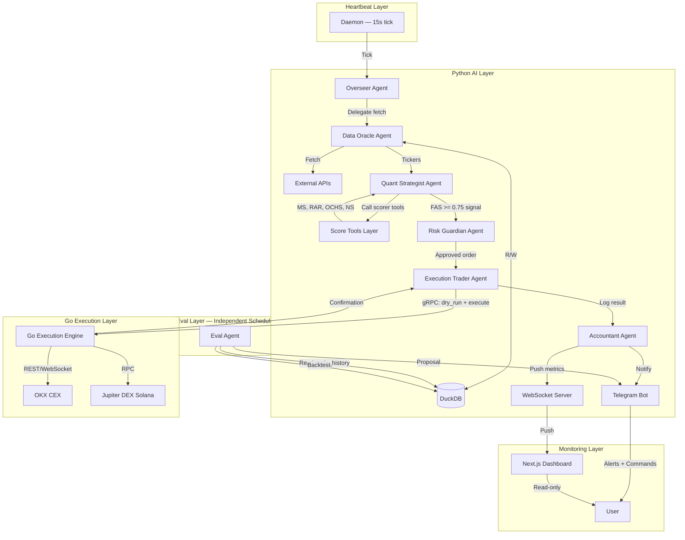

# ARCHITECTURE.md — CryptoHedgeAI Crew
> Technical reference for the hybrid Python + Go autonomous trading system.

---

## 1. System Overview

CryptoHedgeAI is a **dual-layer autonomous trading system**:

- **Python Layer (AI Brain):** CrewAI-orchestrated agents handle reasoning, scoring, evaluation, and decision-making.
- **Go Layer (Execution Engine):** Handles real-time market streaming, order execution, and on-chain interactions with sub-100ms latency.
- **Next.js Dashboard:** Real-time monitoring UI pushed via WebSocket.

The two layers communicate exclusively via **gRPC** — no shared memory, no direct DB access from Go.

---

## 2. High-Level Architecture



---

## 3. Layer Breakdown

### 3.1 Heartbeat Daemon

- Fires tick every 15 seconds
- No business logic — only triggers Overseer
- Cron job inside container ensures restart on failure

### 3.2 Agent Execution Order (per tick)

```
Overseer → Data Oracle → [Score Tools] → Quant Strategist → Risk Guardian → Execution Trader → Accountant
```

Eval Agent runs on independent schedule:
- Micro: every 2 weeks
- Quarterly: every 3 months
- Annual: every 12 months

### 3.3 Score Tools Layer

Tools are deterministic Python functions — NOT AI. Each returns float 0.0–1.0.

| Tool               | Input                                  | Score Logic                          |
|--------------------|----------------------------------------|--------------------------------------|
| `momentum_scorer`  | OHLCV 24h, volume                      | RSI + MACD + price velocity          |
| `rar_scorer`       | OHLCV 7d, volatility                   | Sharpe-like ratio + max drawdown     |
| `onchain_scorer`   | Covalent: addresses, tx count, holders | 7d growth delta                      |
| `narrative_scorer` | CryptoPanic, Fear & Greed              | Sentiment polarity + regime modifier |

### 3.4 Go Execution Engine

gRPC service definition:

```protobuf
service ExecutionEngine {
    rpc DryRunSwap(SwapRequest) returns (DryRunResult);
    rpc ExecuteSwap(SwapRequest) returns (SwapResult);
    rpc StreamMarketData(StreamRequest) returns (stream MarketTick);
    rpc GetPortfolio(Empty) returns (PortfolioState);
    rpc Liquidate(LiquidateRequest) returns (LiquidateResult);
}

message SwapRequest {
    string ticker = 1;
    double size_usd = 2;
    string exchange = 3;  // "okx" | "jupiter"
    bool is_sell = 4;
}

message DryRunResult {
    double estimated_slippage = 1;
    double price_impact = 2;
    double estimated_output = 3;
    bool is_safe = 4;
}
```

### 3.5 DuckDB Schema

```sql
-- market_cache
CREATE TABLE IF NOT EXISTS market_cache (
    ticker VARCHAR PRIMARY KEY,
    sector VARCHAR,
    metrics_json JSON,
    last_updated TIMESTAMP DEFAULT CURRENT_TIMESTAMP
);

-- trade_history
CREATE TABLE IF NOT EXISTS trade_history (
    id UUID DEFAULT gen_random_uuid() PRIMARY KEY,
    ticker VARCHAR NOT NULL,
    entry_p DECIMAL(18,8),
    exit_p DECIMAL(18,8),
    fas_score DECIMAL(5,2),
    pnl DECIMAL(18,8),
    created_at TIMESTAMP DEFAULT CURRENT_TIMESTAMP
);

-- system_config
CREATE TABLE IF NOT EXISTS system_config (
    param_name VARCHAR PRIMARY KEY,
    param_value VARCHAR NOT NULL,
    is_locked BOOLEAN DEFAULT FALSE
);

-- ops_ledger
CREATE TABLE IF NOT EXISTS ops_ledger (
    id UUID DEFAULT gen_random_uuid() PRIMARY KEY,
    amount DECIMAL(18,8) NOT NULL,
    category VARCHAR NOT NULL,
    description VARCHAR,
    auto_executed BOOLEAN DEFAULT FALSE,
    timestamp TIMESTAMP DEFAULT CURRENT_TIMESTAMP
);

-- eval_history
CREATE TABLE IF NOT EXISTS eval_history (
    id UUID DEFAULT gen_random_uuid() PRIMARY KEY,
    period_type VARCHAR NOT NULL,
    period_start DATE,
    period_end DATE,
    roi_actual DECIMAL(8,4),
    roi_target DECIMAL(8,4),
    met_target BOOLEAN,
    config_snapshot JSON,
    action_taken VARCHAR,
    created_at TIMESTAMP DEFAULT CURRENT_TIMESTAMP
);
```

---

## 4. Data Flow: Full Trade Lifecycle

```
[15s Tick]
    ↓
[Overseer] checks EMERGENCY_STOP flag
    ↓
[Data Oracle] fetches 300 coins → updates market_cache
    ↓
[Score Tools] calculate MS, RAR, OCHS, NS per coin (deterministic)
    ↓
[Quant Strategist] applies FAS = (0.4×MS)+(0.2×RAR)+(0.3×OCHS)+(0.1×NS)
    filters: FAS >= 0.75 only
    ↓
[Risk Guardian] checks: sector cap, drawdown, chain eligibility, slippage estimate
    APPROVE or VETO (final, cannot be overridden)
    ↓
[Execution Trader]
    → gRPC: dry_run_swap() → verify slippage < 2.0%
    → gRPC: execute_swap() → wait tx confirmation (30s timeout)
    ↓
[Accountant]
    → log to trade_history
    → profit_tax = gross_pnl × 0.005 → ops_fund
    → push WebSocket event to dashboard
    → send Telegram notification
```

---

## 5. Self-Financing Flow

```
Every Profitable Trade:
    gross_pnl = (exit_price - entry_price) × position_size
    profit_tax = gross_pnl × 0.005   ← 0.5% (HARDCODED)
    ops_fund += profit_tax
    user_net = gross_pnl - profit_tax

Bill Payment Timeline:
    T-7d  → Telegram notification to user (approve/reject buttons)
    T-1d  → Urgent reminder if no response
    T-0d  → AUTO-PAY if ops_fund >= bill_amount + 2× monthly_burn_reserve
             → Payment to whitelisted address only
             → Log to ops_ledger (auto_executed=TRUE)
             → Telegram confirmation sent
```

---

## 6. Evaluation Architecture

```
MICRO (biweekly):
  Check win_rate + FAS accuracy
  If win_rate < 45%: adjust weights ±10% (auto, no approval needed)

QUARTERLY:
  Compare ROI vs quarterly_target (default: +10%)
  MISS → backtest quarter data → reconfigure weights → proposal if formula change needed
  HIT  → freeze config as proven_config

ANNUAL:
  Aggregate all 4 quarters vs annual_target (default: +40%)
  Generate annual_report.json
  Push summary to Telegram + Dashboard
```

---

## 7. Security Architecture

```
Secret Management:
  .env → python-dotenv → loaded once at startup via core/config.py
  NEVER logged, printed, passed between agents, or sent via Telegram

Execution Safety:
  Dry-run mandatory before every swap
  Slippage veto: > 2.0% = abort (HARDCODED)
  Whitelist-only: bill payment targets
  Emergency stop: EMERGENCY_STOP flag in system_config
  Only clearable by user via Telegram /resume

Network Isolation:
  Go engine: internal localhost gRPC only
  Dashboard WebSocket: JWT-authenticated
  Telegram webhook: secret token validation
```

---

## 8. Docker Compose Structure

```yaml
services:
  python_brain:
    build: .
    volumes:
      - ./data:/data
    env_file: .env
    depends_on: [go_engine]
    restart: unless-stopped

  go_engine:
    build: ./go_engine
    ports:
      - "50051:50051"
    restart: unless-stopped

  dashboard:
    build: ./dashboard
    ports:
      - "3000:3000"
    environment:
      - NEXT_PUBLIC_WS_URL=ws://python_brain:8000/ws/live
    restart: unless-stopped
```

---

## 9. Exchange & Chain Config

| Exchange | Type | Chain       | Condition                     |
|----------|------|-------------|-------------------------------|
| OKX      | CEX  | Multi-chain | Default — lower fees, no gas  |
| Jupiter  | DEX  | Solana      | Alpha plays, new tokens       |
| —        | —    | ETH         | ONLY if total capital > $1000 |

Active chains: **SOL > BSC > BASE > ETH (capital-gated)**

---

## 10. Performance Targets

| Metric          | Target       | Hardcoded?        |
|-----------------|--------------|-------------------|
| Scan 300 coins  | < 8 seconds  | Yes               |
| Order execution | < 100ms      | Yes (Go layer)    |
| Heartbeat cycle | < 14 seconds | Yes               |
| Quarterly ROI   | +10%         | No (configurable) |
| Annual ROI      | +40%         | No (configurable) |
| Max drawdown    | ≤ 15%        | Yes               |
| Max slippage    | ≤ 2.0%       | Yes               |